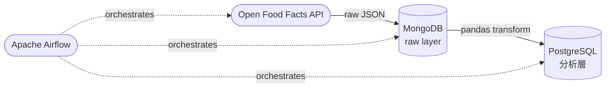

```mermaid
flowchart LR
    A([Open Food Facts API]) -->|raw JSON| B[(MongoDB\nraw layer)]
    B -->|pandas transform| C[(PostgreSQL\n分析層)]
    D([Apache Airflow]) -..->|orchestrates| A
    D -..->|orchestrates| B
    D -..->|orchestrates| C
```
